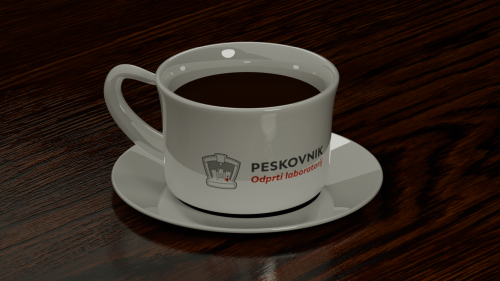

# [PRIJAVA NA DELAVNICE (prijave so odprte do zapolnitve mest)](https://1ka.arnes.si/aktualnedelavnice)

&nbsp;

&nbsp;

---

&nbsp;

## Osnove struženja kovinskih materialov - 1. del
### Ponedeljek ob 16.00

&nbsp;

Delavnica je namenjena študentom, ki se želijo naučiti osnov obdelave kovin. Na delavnici se boste naučili osnovnih tehnik uporabe stružnice, kot so nastavljanje hitrosti, vpenjanje kosa, izbira orodja in nastavljanje globine rezanja. Poleg tega boste spoznali varnostne ukrepe pri delu s stružnico ter se naučili prepoznati in preprečevati morebitne nevarnosti. Na koncu delavnice boste imeli priložnost izdelati svoj lasten izdelek. 

&nbsp;

Delavnica je namenjena tako začetnikom kot tudi tistim z že nekaj izkušnjami, ki bi želeli uporabljati stružnico in orodja v Peskovniku.

&nbsp;

---

&nbsp;

## Osnove struženja kovinskih materialov - 2. del 
### Torek ob 14.00

&nbsp;

Na delavnici se bomo naučili centriranja obdelovanca s štiričeljustno glavo, merjenja izteka (ang. *runout*) obdelovancev ter natančnega merjenja obdelovancev.

&nbsp;

Del delavnice bo posvečen tudi odgovarjanju na vprašanja udeležencev in pomoči pri njihovih dotičnih strugarskih projektih.
 
&nbsp;

**Opomba:** Obvezna udeležba na delavnici *Osnove struženja kovinskih materialov - 1. del*.

&nbsp;

---

&nbsp;

## Blender za začetnike
### Sreda ob 16:30

&nbsp;

Blender je vodilni brezplačni odprtokodni program, namenjan predvsem umetniškemu ustvarjanju 3D modelov, animaciji, predstavitvi izdelkov, urejanju videov, ustvarjanju VFX učinkov, ...

Na delavnici se bomo spoznali z osnovami uporabe programa; skozi praktično delo se boste naučili modeliranja s pomočjo površin in krivulj, uporabe modifierjev, ustvarjanja tekstur ter rendanja (fotografiranje scene).

&nbsp;

**Opomba:** Za udeležbo na delavnici potrebujete svoj računalnik in miško. Da bomo lahko hitreje začeli, si namestite zadnjo različico Blenderja  (https://www.blender.org/download/) 

&nbsp;

<!--- 

-->

---

&nbsp;

## Družabni dogodek

### Četrtek ob 14.00

&nbsp;

Družabni dogodki so namenjeni povezovanju članov oz. potencialnih novih članov Peskovnika ob prigrizkih, družabnih igrah in drugih aktivnostih (vožnja na simulatorju) . Dogodek bo sledil tedenskemu sestanku, ki poteka vsak četrtek ob 14.00.

&nbsp;

---

&nbsp;

## Osnove dela s kompoziti (forged carbon) - 2. del
### Petek ob 16.00

&nbsp;

Na delavnici bomo razkalupili predhodno laminirane izdelke in jih obdelali do končne kakovosti površine (ang. *post-processing*). Pogovorili se bomo tudi o morebitnih napakah, ki so nastale med izdelovalnim procesom.

&nbsp;

*Zaželena predhodna udeležba na 1. delu delavnice.*

&nbsp;

---

&nbsp;

### Udeležba na vseh delavnicah in aktivnostih Peskovnika je brezplačna. 
### Opravljene delavnice oz. usposabljanja za stroje so pogoj za uporabo opreme in strojev v Peskovniku.

&nbsp;

---

&nbsp;

# [PRIJAVA NA DELAVNICE (prijave so odprte do zapolnitve mest)](https://1ka.arnes.si/aktualnedelavnice)

&nbsp;

Prijavi se na delavnice, ki te zanimajo in katerih se imaš namen udeležiti.
Če si se na delavnico prijavil/a pa se je ne moreš udeležiti nam to prosim pravočasno sporoči na [peskovnik@fs.uni-lj.si](mailto:peskovnik@fs.uni-lj.si), da lahko tvoje mesto na delavnici sprostimo za koga drugega.

&nbsp;

*Če v tem tednu ni delavnice, ki bi te zanimala, nam lahko prek obrazca https://1ka.arnes.si/potencialnedelavnice sporočiš katere delavnice oz. izobraževanja bi te zanimala, da jih skušamo v prihodnosti izvesti več.*

&nbsp;

**Če pa imaš zanimiva (bolj ali manj tehnična in praktična) znanja, ki bi jih želel deliti med druge študente pa si povabljen/a, da pripraviš in izvedeš delavnico v Peskovniku (npr. vlivanje aluminija, kovanje, šivanje, delo z usnjem, vakuumiranje plastike, brizganje, hydrodipping, airbrush, Arduino, popravljanje motorjev, radioamaterstvo, izdelava tiskanih vezij,...). Za pripravo nove delavnice nam piši na [peskovnik@fs.uni-lj.si](mailto:peskovnik@fs.uni-lj.si) oz. se oglasi v Peskovniku, da se dogovorimo o poteku in načinu dela.**

