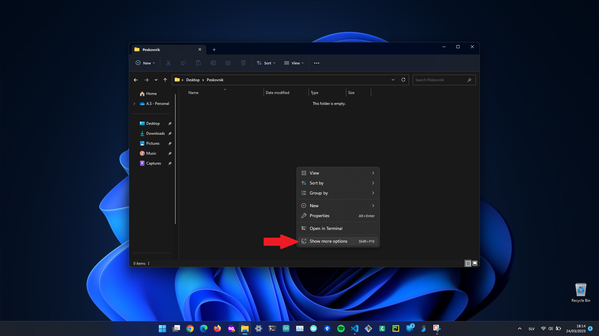

# Navodila za uporabo
Spletna stran je zgrajena s sistemom za generiranje statičnih spletnih strani [Hugo](https://gohugo.io/). Vsebino spletne strani dodajamo v obliki markdown (`.md`) datotek. Sisem hugo nato te datoteke pretvori v `.html` datoteke, ki jih prikaže brskalnik.

## Potrebna programska oprema
Za urejanje spletne strani potrebujemo naslednja orodja:
- urejevalnik teksta (priporočamo [VS Code](https://code.visualstudio.com/), [Notepad++](https://notepad-plus-plus.org/),...)
- sistem [Git](https://git-scm.com/) ([prenos](https://git-scm.com/download/win))
- V kolikor si želimo pred pošiljanjem sprememb na stržnik ogledati narejene spremembe moramo namestiti tudi program [Hugo](https://gohugo.io/) ([prenos](https://github.com/gohugoio/hugo/releases)).

Ko na računalnik namestimo Git se namesti tudi ukazna vrstica Git Bash. V nadaljevanju so navedeni ukazi, ki jih moramo pognati v Git Bash (in ne PowerShell ali CMD, saj se ti nekoliko razlikujeta).

## Priprava
Preden pričnemo z urejanjem spletne strani moramo s GitHib strežnika prenesti repozitorij.
### 0) Izberemo lokacijo, kjer želimo da se prenesejo datoteke
### 1) Z desnim miškinim gumbom kliknemo na praznem prostor

### 2) Izberemo `Show more options`

### 3) Izberemo `Git Bash Here` - s tem odpremo ukazno vrstico

### 4) V ukazni vrstici poženemo:
```bash
git clone git@github.com:OLFS-Peskovnik/spletna_stran.git
```
### 5) Hugo
Prenesemo [Hugo](https://github.com/gohugoio/hugo/releases), razširimo `.zip` datoteko in kopiramo datoteko `hugo.exe` v projektno mapo.

## Predogled spletne strani
Če si želimo ogledati narejene spremembe, preden jih pošljemo na GitHub strežnik, lahko znotraj projektne mape (`spletna_stran`) odpremo ukazno vrstico (glej [Priprava](#priprava)) in poženemo naslednji ukaz:
```bash
./hugo.exe serve
```
S tem se zažene razvojni strežnik, ki omogoča lokalni predogled spletne strani na naslovu: [http://localhost:1313/](http://localhost:1313/). 

# Dodajanje vsebin
Vsebine dodajamo v mapi `content`, kjer se nahajajo pod-mape za različne tipe vsebin.

Vsebne lahko dodajamo na dva načina:
- z ročnim dodajanjam datotek
- avtomatsko - z programom Hugo (potreban je [namestitev](#5-hugo)).

Priporočena je uporaba slednjega načina, saj se s tem močno zmanjšajo močnosti za napake.

## Novo obvestilo:
### Ukazna vrstica (npr.: Git Bash)
Poženemo naslenji ukaz in pri tem nadomestimo `<ime-mapice>` z reprezentativnim imenom obvestila (npr.: `delavnice-20-4-2023`). Paziti je potrebno, da v imenu ni šumnikov ali presledkov.
```bash
./hugo.exe new --kind obvestila obvestila/<ime-mapice>
```
### Ročno kreiranje datotek
- Ustvarimo novo mapico znotraj mape `obvestila` (torej: `content/obvestila`), z reprezentativnim imenom (npr.: `delavnice-20-4-2023`)
- Znotraj nove mapice ustvarimo datoteko `index.md` in v prve vrstice datoteke zapišemo naslednje:
```
---
title: "<Naslov obvestila>"
date: 2023-02-01T14:00:07+01:00
description: "<Opis obvestila, ki se prikaže ob naslovu.>"
---
```
Pazimo da je datum zapisan v naslednjem formatu:
`YYYY-MM-DDThh:mm:ss+01:00`
| oznaka | pomen |
| :-- | :-- |
| Y | **leto** (npr.: `2023`) |
| M | **mesec** (npr.: `02` za februar) |
| D | **dan** (npr.: `01` za prvi dan v mesecu) |
| h | **ura** (npr.: `16` za četrto uro popoldne) |
| m | **minuta** (npr.: `05` za pet minut) |
| s | **sekunda** (npr.: `00`) |
Ker ure, še posebej pa minute in sekunda niso tako pomembne lahko v njihova polja vpišemo `00`, **pomembno pa je da se držimo predpisanega formata in jih ne izpustimo!** Torej na primer: `2023-04-20T00:00:00+01:00`

## Nov dokument:
V ukazni vrstici poženemo:
```bash
./hugo.exe new --kind dokumenti dokumenti/<naziv-dokumenta>
```

## Nova oprema:
V ukazni vrstici poženemo:
```bash
./hugo.exe new --kind oprema oprema/<naziv-opreme>
```

## Nov projekt:
V ukazni vrstici poženemo:
```bash
./hugo.exe new --kind projekti projekti/<naziv-projekta>
```

## Dodajanje ali odstranjevanje donatorjev
Donatorje urejamo v datoteki: `layouts\partials\sponsors.html`

# Pošiljanje sprememb na strežnik GitHub
Ko smo zadovoljni z narejenimi spremembami jih pošljemo na strežnik. Najprej v projketni mapi odpremo ukazno vrstico in poženemo naslednje ukaze:
```bash
git add content
```
```bash
git commit -m "<Kratek opis sprememb>"
```
```bash
git push origin main
```